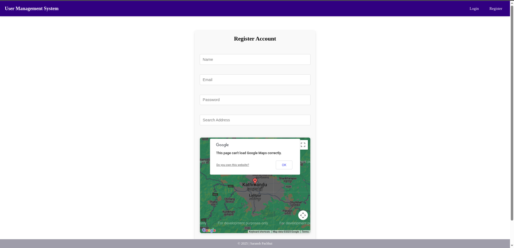
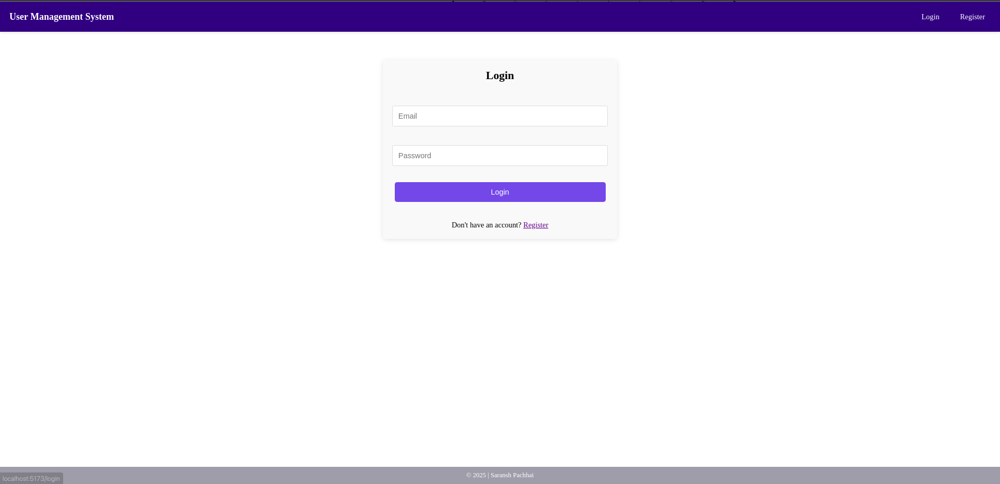
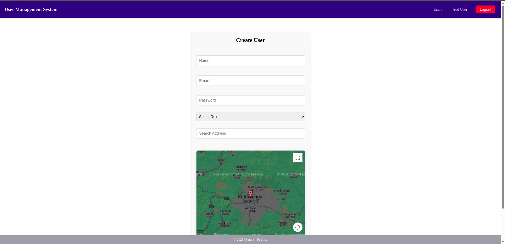
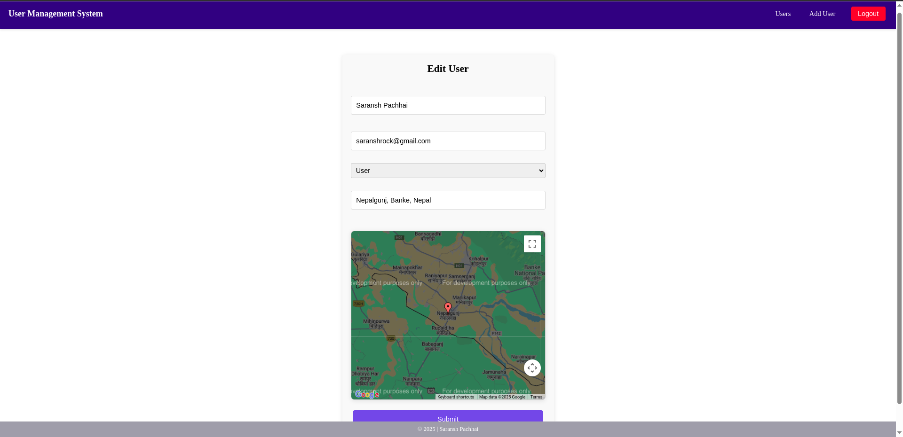
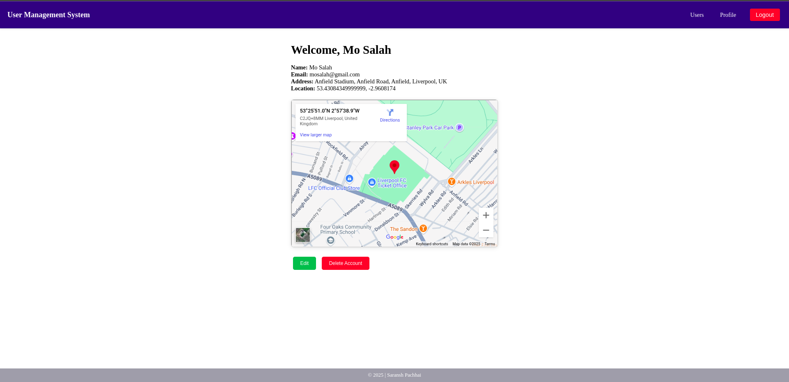

# User Management System

## Overview

The User Management System is a full-stack application designed to manage users with various roles (admin, editor, user). It includes features for user registration, login, profile management, and user administration. The system integrates with Google Maps and GoMaps for location-based services.

## Features

- **User Authentication**: Secure login and registration with JWT (JSON Web Tokens).
- **Role-Based Access Control**: Different roles (admin, editor, user) with varying permissions.
- **Profile Management**: Users can view and edit their profiles.
- **Location Integration**: Uses Google Maps and GoMaps for address validation and location services.
- **Pagination and Search**: Efficient user listing with pagination and search functionality.

## Role-Based Access Control

### Admin Role

Can perform all operations (Create, Read, Update, Delete).
Can manage user roles (assign roles to users).
Only admins can delete users or editors.

### Editor Role

Can view all users.
Can create new users.
Can update user details.
Cannot delete users.

### User Role

Can only view the list of users.
Can edit their own account details.
Can delete their own account (permanently deletes the account).

## Technologies Used

- **Frontend**: React, Vite, TypeScript
- **Backend**: Node.js, Express.js, TypeScript
- **Database**: MongoDB
- **API**: RESTful API
- **Map Integration**: Google Maps JavaScript API, Geocoding API, GoMaps API
- **Hosting**: Frontend on Netlify, Backend on Render

## Installation

### Prerequisites

- Node.js
- Bun
- MongoDB
- Google Maps API Key
- GoMaps API Key

### Steps

1. **Clone the repository**

   ```bash
   git clone https://github.com/saransh619/user-management-system.git
   cd user-management-system
   ```

2. **Install Dependencies**
   For the frontend:

   ```bash
   cd client
   bun install
   ```

   For the backend:

   ```bash
   cd server
   bun install
   ```

3. **Configure Environment Variables**

   Create a `.env` file in the `server` directory and add the following variables:

   ```bash
   MONGO_URI=mongodb://localhost:27017/user_management_system
   JWT_SECRET_KEY=<your-jwt-secret-key>
   PORT=5000
   GOOGLE_API_KEY=<your-google-maps-api-key>
   GOMAPS_API_KEY=<your-gomaps-api-key>

   For testing purpose you can use below credentials:
   ADMIN_EMAIL=admin@gmail.com
   ADMIN_PASSWORD=Admin@123
   ```

4. **Run the Application**

   Start the frontend:

   ```bash
   cd client
   bun dev
   ```

   Start the backend:

   ```bash
   cd server
   bun dev
   ```

## API Endpoints

- **Auth**

  - POST /api/auth/login - User login
  - POST /api/auth/register - User registration

- **Users**

  - GET /api/users - Get all users
  - GET /api/users/:id - Get user by ID
  - POST /api/users - Create user
  - PUT /api/users/:id - Update user
  - DELETE /api/users/:id - Delete user

## Hosting

**Frontend**: Hosted on Netlify - [https://user-mgt-system.netlify.app/](https://user-mgt-system.netlify.app/)  
**Backend**: Hosted on Render - [https://user-management-system-d0x3.onrender.com/](https://user-management-system-d0x3.onrender.com/)  

## Map Integration

- **Google Maps**: Used for Maps JavaScript API and Geocoding API.  
- **GoMaps**: Used for Places API.  

## Screenshots

Here are some screenshots of the application:

- **Register Page**

  

- **Login Page**

  

- **User List Page**

  - Admin User List

  .png>)

- **Create User**

  

- **Edit User**

  

- **User Profile**

  

## Contributing

Contributions are welcome! Please fork the repository and create a pull request with your changes.
